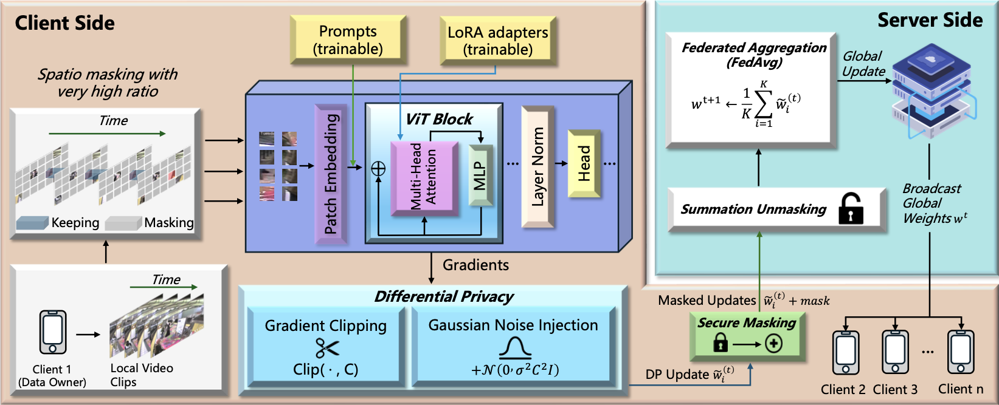
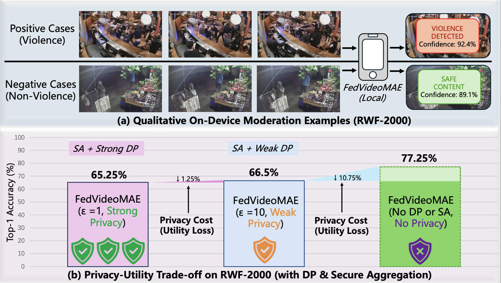

# Federated VideoMAE (pMAE-style) for Self-Supervised Video Classification

**Paper:** [FedVideoMAE: Efficient Privacy-Preserving Federated Video Moderation](https://arxiv.org/abs/2512.18809)



This project adapts the pMAE paradigm of "parameter-efficient + reconstructive prompt + server-side reconstruction/fine-tuning" to the video domain, based on VideoMAE for self-supervised pretraining, and performs federated evaluation (linear probing/small head fine-tuning) on RWF-2000. It can be smoothly extended to similar datasets like RLVS, HockeyFight, UCF-Crime, etc.

## Features Overview
- Federated self-supervised pretraining (FedAvg, parameter-efficient: LoRA + reconstructive prompt)
- Client-side: Only train PEFT parameters (LoRA, Prompt, small head), freeze backbone
- Server-side: Aggregate parameters, optional "server-side reconstruction/fine-tuning" for prompt or head alignment
- Evaluation:
  - Linear probing (freeze backbone + federated training of linear head)
  - Small head fine-tuning (freeze backbone + federated fine-tuning of small head with few parameters)
- Dataset: RWF-2000 (extensible to other datasets)



## Dependencies
Recommended Python 3.9

Quick installation:

```bash
pip install -r requirements.txt
```

The `requirements.txt` provides minimum dependencies. If you already have local repositories (like `VideoMAE/`, `pMAE/`), you don't need to install them.

## Data Preparation (RWF-2000)

### 1. Dataset Structure

Organize your RWF-2000 dataset as follows:

```
RWF-2000/
├── train/
│   ├── Fight/
│   │   └── *.avi
│   └── NonFight/
│       └── *.avi
└── val/
    ├── Fight/
    │   └── *.avi
    └── NonFight/
        └── *.avi
```

The dataset contains training and validation splits, with each split containing two categories: Fight (violent behavior) and NonFight (non-violent behavior). Video files are in AVI format.

### 2. Create Client Data Partitions (Optional)

Pre-partition client data (IID/non-IID):

```bash
python -m FedVideomae_DP.data.partition \
  --data_root /your/data/RWF-2000 \
  --out_json partitions/rwf2000_iid_10c.json \
  --num_clients 10 --strategy iid
```

### 3. Update Configuration Files

Update `data.root` and `data.partitions` paths in `configs/*rwf2000.yaml` to point to your actual paths.

## Training and Evaluation

### 1. Federated Self-Supervised Pretraining

```bash
python -m FedVideomae_DP.train.fl_pretrain \
  --config configs/pretrain_rwf2000.yaml
```

### 2. Linear Probing (Central)

```bash
python -m FedVideomae_DP.train.central_linear_probe \
  --config configs/linear_probe_rwf2000_epsilon_1.yaml
```

The provided config points to a specific pretrained checkpoint. Duplicate and edit it to match your run (e.g., epsilon target, checkpoint path, output_dir).

### 3. Small-Head Fine-tuning

- Federated small-head fine-tuning (use your fine-tune config with a federated block):

```bash
python -m FedVideomae_DP.train.fl_fine_tuning \
  --config <your_federated_finetune_config>.yaml
```

- Central small-head fine-tuning (weak head):

```bash
python -m FedVideomae_DP.train.central_weak_finetune \
  --config configs/central_weak_finetune_rwf2000.yaml
```

### 4. Evaluation (Pretrained or Small-Head)

Typical classification evaluation with threshold scan and TTA, without extra outputs:

```bash
python -m FedVideomae_DP.train.evaluate \
  --config configs/evaluate_small_head_rwf2000.yaml \
  --model_type small_head \
  --threshold_scan \
  --scan_metric f1_macro \
  --tta_hflip \
  --temporal_clips 3 \
  --deterministic_temporal
```

- Omit `--output_dir`, `--visualize`, and `--extract_features` to use defaults and skip visuals/features.
- To fix the decision threshold manually, pass `--threshold 0.50` (overrides scan).
- To re-compute metrics at the best scanned threshold, add `--apply_best_threshold`.

For reconstruction evaluation on a pretrained model:

```bash
python -m FedVideomae_DP.train.evaluate \
  --config configs/evaluate_small_head_rwf2000.yaml \
  --model_type pretrained
```

### 5. Feature Analysis

```bash
python -m FedVideomae_DP.train.analyze_features \
  --feature_path evaluation_results/features.pth \
  --output_dir feature_analysis
```

## Key Concepts
- **Parameter Efficiency (PEFT)**: Insert LoRA into attention/MLP linear layers, train only small parameters, reducing communication/privacy leakage risks.
- **Reconstructive Prompt**: Inject learnable prompt tokens during self-supervised reconstruction to assist masked video block reconstruction.
- **Server-side Reconstruction/Fine-tuning**: Server maintains (aggregated) prompts/small heads, optionally performs reconstruction/consistency fine-tuning on small public buffer to align cross-client feature spaces.

## Code Structure
```
FedVideomae_DP/
  configs/          # Configuration files
  data/            # Data loading and preprocessing
  fl/              # Federated learning components
  models/          # Model definitions and wrappers
  train/           # Training and evaluation scripts
  scripts/         # Utility scripts
```

## Environment Check

To verify your environment setup:

```bash
python scripts/check_env.py
```

This will print versions of key libraries and basic introspection of the Transformers VideoMAE API.

## Notes
- By default uses HuggingFace `VideoMAEForPreTraining` as backbone; will automatically download weights on first run (can set `model_name`).
- If running environment cannot connect to internet or you don't want automatic downloads, set `model_name: null` in config and provide local weight path, or only use feature mode (avoid pretraining).
- Initial version is a runnable baseline skeleton, easy to extend as needed (e.g., RLVS, HockeyFight, UCF-Crime).

## Configuration Files

- `configs/pretrain_rwf2000.yaml` — Federated pretraining configuration
- `configs/linear_probe_rwf2000_epsilon_1.yaml` — Linear probing (central) example; duplicate and edit for your run
- `configs/central_weak_finetune_rwf2000.yaml` — Central small-head fine-tuning configuration
- `configs/evaluate_small_head_rwf2000.yaml` — Evaluation (small-head) example; can also be used with `--model_type pretrained`

## Output Files

After running evaluation scripts, you'll find:
- `evaluation_results/` - Reconstruction quality metrics and visualizations
- `feature_analysis/` - Feature distribution analysis and visualizations
- `runs/` - Training logs and model checkpoints
